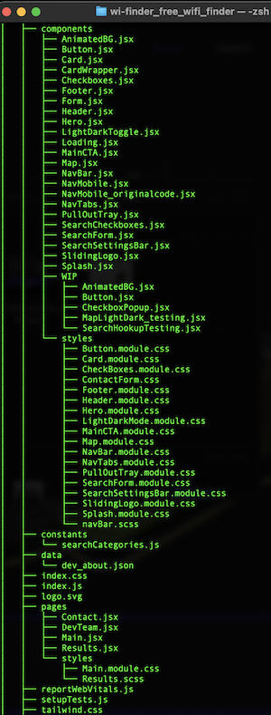

<!-- Readme top-->
<a name="readme-top"></a>

<!-- Project shields -->
<span style="display:block" align="center" class="shields">

[![Stargazers][stars-shield]][stars-url]
[![Issues][issues-shield]][issues-url]
[![License][license-shield]][license-url]
[![LinkedIn][linkedin-shield]][linkedin-url]

</span>

<!-- Readme Header -->
<div align="center">
	
</div>
<br>

<!-- project title -->
#
<div align="center">
  <h2><b>WiFi<b>NDER - Your "get online wherever app!"</h2>
  <h3>Team WiFinder - Collaboration Project</h3>
  <p>Deployed Project Link: [https://wi-finder.netlify.app]</p>
</div>


<div align="center">
<p>Ultimate Wi-Fi Hot spot and hangout locator app, built using React.js, Node.js, JavaScript, Tailwind, CSS and HTML5.</p>

<a href="https://github.com/Matt-Jones-Developer/wi-finder_free_wifi_finder/"><strong>Explore the docs »</strong></a>
<br />
<br />
<a href="https://github.com/Matt-Jones-Developer/wi-finder_free_wifi_finder/">View Project</a>
·
<a href="https://github.com/Matt-Jones-Developer/wi-finder_free_wifi_finder/issues">Report Bug</a>
·
<a href="https://github.com/Matt-Jones-Developer/wi-finder_free_wifi_finder/issues">Request Feature</a>
·
<a href="https://github.com/matt-jones-developer?tab=repositories">Check out our work</a>
·
</div>
<br>

#

## Table of Contents

* [About The Project](#about)
* [User Story](#userstory)
* [Built With](#builtwith)
* [Installation](#installation)
* [Usage](#usage)
* [Tests](#tests)
* [Contributing](#contributing)
* [License](#license)
* [Questions](#questions)
* [Acknowledgements](#acknowledgements)
#

<!-- about the project -->
## Project Summary

Welcome to our final project (but first of many) "WiFinder" - Built for digital nomads who need to find food, warmth and most importantly FREE WIFI!
A 4-team collaborative build using React, Node.js, TailwindCSS and JavaScript.  A unique, attractive, API driven web application utilizing Google Maps, GeoApify, FormJS and deployed to Netlify!  

<!-- video of finished product -->
<div align="center">
  
</div>

#
### Motivation

AS digital nomads, we work to travel. One day my office is a Starbucks and the next an airport lounge. Utilising local network providers is not always possible, so it’s critical I can find free wi-fi.

We wanted users to be able to quickly log into a web app on their phone and hit one button to easily find their nearest free wi-fi hot-spot. They need to be able to see on the map how they can get there, what food and entertainment is nearby and get logged on to some wifi. When  planning trips in advance we want to be able to put in any destination details to find out what free WiFi is available in that area to the user.

SO that way, they can always be connected when they need to be.


#
### Challenges

Key Challenges

Building a professional, functional, attractive web app in under 2 weeks
Successfully collaborating, designing & split-building using Github & React 
Getting the API’s to work effectively to deliver results and make MVP

Key Successes
Achieving MVP, deploying a decent looking, functional, useful application
Working harmoniously as a solid unit, each bringing their best to the team
Successfully integrating and learning React, Node and Tailwind

#
### Unique Selling Points

**Easy-to-use interface:** The WiFinder app is user-friendly and simple to navigate, 
making it easy for digital nomads and remote workers to find and connect to wifi 
hotspots quickly and easily.

**Location-based services:** The app uses location-based services to find wifi 
hotspots near the user's current location, which means that users can quickly find a 
nearby wifi hotspot without having to search manually.

**Comprehensive database:** WiFinder has an extensive database of wifi hotspots, 
including coffee shops, libraries, and other public areas, making it easy for users
to find a nearby wifi hotspot wherever they are.

**Reliable connections:** WiFinder only lists reliable and secure wifi hotspots, so 
users can trust that they'll be able to connect and work without interruption.

**Free service:** WiFinder is a free service, which makes it an excellent choice for 
budget-conscious digital nomads and remote workers.


<p align="right">(<a href="#readme-top">back to top</a>)</p>

#
## Installation

The build is deployed and ready to view it, head to: 
[ "Wifinder.com"](https://wi-finder.netlify.app) 

### Installation Instructions

Launch the app by opening your web browser and navigating to the app's URL.


## Usage

Navigate the site using the navbar.  If on mobile you can use the hamburger icon and select an item from the slide out menu.

View details about the team, our project and contact us via the form or any social media links.

View the final product screenshots below:

<div align="center">
  
</div>
<div align="center">
  
</div>
<div align="center">
  
</div>
<div align="center">
  
</div>

<div align="center">
<p>Screenshots of the apps output with
fully responsive design:</p>
</div>

<!-- tablet screenshots -->
<div align="center">
<!-- ![tablet-screenshot1] ![tablet-screenshot2] -->
  
  
</div>
<!-- centered images -->
<div align="center">
<!-- ![mobile-screenshot1] ![mobile-screenshot2] -->
  
  
</div>
<div align="center">
<!-- ![mobile-screenshot1] ![mobile-screenshot2] -->
  
  
</div>

<div align="center">
  
</div>
<div align="center">
  
</div>
<div align="center">
  
</div>
<div align="center">
  
</div>
<div align="center">
  
</div>
<div align="center">
  
</div>
<div align="center">
  
</div>
<div align="center">
  
</div>

<p align="right">(<a href="#readme-top">back to top</a>)</p>

## Tests

Jest was used for all testing.  You can test the app using:
```
npm run test 
```

<div align="center">
  <div align="center">
    
    
  </div>
</div>
  <div align="right">
    <p>We used a lot of nom packages along with React and   Tailwind. <br>Here is our project structure tree
    </p>
  </div>


## Contributing

Team WiFinder is made up of 4 talented engineers:

 🪄 [Marc Hudson](https://github.com/marcahudson26) 
 🪄 [Matt Jones](https://github.com/Matt-Jones-Developer)
 🪄 [Fionnuala O'Donnell](https://github.com/Fi-OD/)
 🪄 [Kelvin Enaro](https://github.com/DeveloperK7E)


<p align="right">(<a href="#readme-top">back to top</a>)</p>

#
## License

This project is licensed under the terms of the General Public License (GNU 3.0)

For more information, please visit this link: [GNU AGPL v3.0](https://choosealicense.com/licenses/agpl-3.0/)


#
## Questions

For questions or concerns, please contact [matt-jones-developer](https://github.com/Matt-Jones-Developer/wi-finder_free_wifi_finder/) via Github.

###  Other contacts:

You can also reach me via the following: 👻💬

 📪 [Email](glitchyghost81@gmail.com) · 💻 [LinkedIn](https://www.linkedin.com/in/matt-jones-zx81) · 👾 [Twitter](glitchy81) · 👻 [Slack](mattjones) · 🤡 [Instagram](glitchy) 

<p align="right">(<a href="#readme-top">back to top</a>)</p>

#

## Deployment & Repo links:

Project Repo Link: [https://github.com/Matt-Jones-Developer/wi-finder_free_wifi_finder/](https://github.com/Matt-Jones-Developer/wi-finder_free_wifi_finder)

Deployed Project Link: [https://wi-finder.netlify.app]

# 
## Acknowledgments

N/A


#
## This Portfolio Was Built In React.js

[![love-shield]][love-url]


#
<br>
<h3>How was this readme created?!
<h3 align="left">Built with <a href="https://github.com/Matt-Jones-Developer/speedme_that_readme_generator/">SPEEDME</a>: The ultimate README generator!</h3>


[stars-shield]: https://img.shields.io/github/stars/matt-jones-developer/wi-finder_free_wifi_finder.svg?style=for-the-badge
[stars-url]: https://github.com/Matt-Jones-Developer/wi-finder_free_wifi_finder/stargazer
[issues-shield]: https://img.shields.io/github/issues/matt-jones-developer/wi-finder_free_wifi_finder.svg?style=for-the-badge
[issues-url]: https://github.com/Matt-Jones-Developer/wi-finder_free_wifi_finder/issues
[license-shield]: https://img.shields.io/github/license/matt-jones-developer/wi-finder_free_wifi_finder.svg?style=for-the-badge
[license-url]: https://github.com/Matt-Jones-Developer/wi-finder_free_wifi_finder/blob/main/LICENSE
[linkedin-shield]: https://img.shields.io/badge/-LinkedIn-black.svg?style=for-the-badge&logo=linkedin&colorB=555
[linkedin-url]: https://www.linkedin.com/in/matt-jones-zx81
[love-shield]: https://img.shields.io/badge/BUILT%20WITH-%F0%9F%92%9A-yellowgreen
[love-url]: https://www.linkedin.com/in/matt-jones-zx81

[product-screenshot]: ./src/assets/screenshots/app_screenshot_1.png
[product-screenshot-2]: ./src/assets/screenshots/app_screenshot_2.png
[product-screenshot-3]: ./src/assets/screenshots/app_screenshot_3.png
[product-screenshot-3]: ./src/assets/screenshots/app_screenshot_4.png
[product-screenshot-5]: ./src/assets/screenshots/app_screenshot_5.png
[product-screenshot-6]: ./src/assets/screenshots/app_screenshot_6.png
[product-screenshot-7]: ./src/assets/screenshots/app_screenshot_7.png
[product-screenshot-8]: ./src/assets/screenshots/app_screenshot_8.png
[product-screenshot-7]: ./src/assets/screenshots/app_screenshot_9.png
[product-screenshot-8]: ./src/assets/screenshots/app_screenshot_10.png

[console-output-screenshot]: ./src/assets/screenshots/component_flow.png
[tablet-screenshot1]: ./src/assets/screenshots/tablet_screenshot_1.png
[tablet-screenshot2]: ./src/assets/screenshots/tablet_screenshot_2.png
[mobile-screenshot1]: ./src/assets/screenshots/mobile_screenshot_1.png
[mobile-screenshot2]: ./src/assets/screenshots/mobile_screenshot_2.png
[mobile-screenshot3]: ./src/assets/screenshots/mobile_screenshot_3.png
[mobile-screenshot4]: ./src/assets/screenshots/mobile_screenshot_4.png


